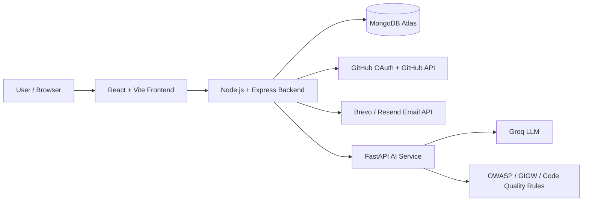
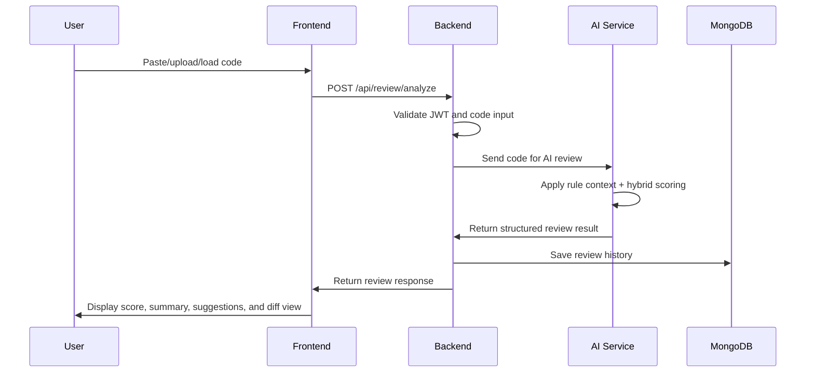
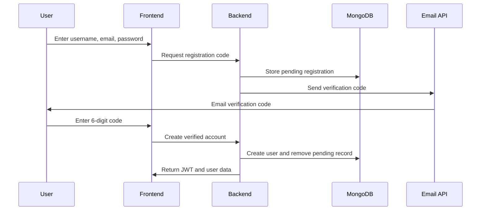
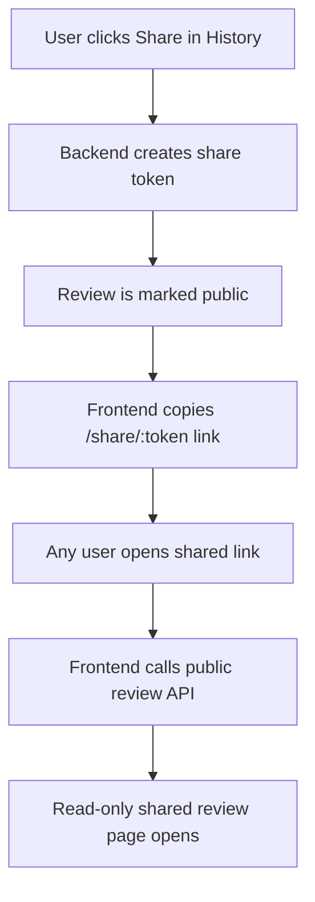

# Meridian.ai — AI-Powered Code Review and Bug Suggestion System

<p align="center">
  
</p>

<p align="center">
  <b>Review smarter. Detect faster. Improve code with AI-guided suggestions.</b>
</p>

<p align="center">
  
  
  
  
  
</p>

---

## Table of Contents

- [Project Overview](#project-overview)
- [Live Deployment](#live-deployment)
- [Problem Statement](#problem-statement)
- [Proposed Solution](#proposed-solution)
- [Key Features](#key-features)
- [Latest Updates](#latest-updates)
- [System Architecture](#system-architecture)
- [Tech Stack](#tech-stack)
- [Project Structure](#project-structure)
- [Environment Variables](#environment-variables)
- [Installation and Setup](#installation-and-setup)
- [Application Routes](#application-routes)
- [Backend API Endpoints](#backend-api-endpoints)
- [AI Review and Scoring Logic](#ai-review-and-scoring-logic)
- [Testing Guide](#testing-guide)
- [Team Contributions](#team-contributions)
- [Security and Validation](#security-and-validation)
- [Deployment Notes](#deployment-notes)
- [Future Scope](#future-scope)
- [Conclusion](#conclusion)

---

## Project Overview

**Meridian.ai** is an AI-powered code review and bug suggestion platform that helps developers identify bugs, security issues, accessibility concerns, performance problems, and code-quality improvements.

Users can submit code by pasting it directly, uploading a code file, or loading code from a GitHub repository. Meridian.ai analyzes the code through an AI microservice and returns a structured review containing an overall quality score, summary, severity-based issues, practical suggestions, and possible refactored code snippets.

The platform also includes authentication, GitHub OAuth, email verification, two-step login verification, password reset, review history, public shared reviews, profile dashboard, theme support, and deployment-ready configuration.

---

## Live Deployment

| Service | URL |
|---|---|
| Frontend | `https://meridian-ai-review.netlify.app` |
| Backend | `https://meridian-backend-7jah.onrender.com` |
| Backend API | `https://meridian-backend-7jah.onrender.com/api` |
| AI Service | `https://meridian-ai-service.onrender.com` |

---

## Problem Statement

Manual code reviews are often slow, inconsistent, and difficult to scale. Reviewers may miss subtle bugs, insecure coding patterns, accessibility issues, or maintainability problems, especially when working with large or unfamiliar codebases.

Traditional linting tools can detect syntax and formatting issues, but they cannot always explain logical mistakes, security risks, or improvement opportunities in a beginner-friendly and structured way.

Developers need a tool that can provide fast, understandable, and actionable feedback before code reaches production or formal review.

---

## Proposed Solution

Meridian.ai provides a web-based platform where users can submit source code and receive AI-generated review feedback.

The system combines:

- A modern **React + Vite frontend** for code submission, review visualization, profile management, and shared review viewing.
- A **Node.js + Express backend** for authentication, review storage, GitHub integration, email workflows, sharing, and secure API handling.
- A **FastAPI AI service** using Groq LLM integration with rule-based context and hybrid issue-based scoring.
- **MongoDB Atlas** for storing users, reviews, pending registrations, profile details, reset tokens, verification data, and public share metadata.

---

## Key Features

### Authentication and User Management

- Email/password registration.
- Email verification before account creation.
- Confirm password validation during signup.
- Login using either username or email.
- Two-step login verification code flow.
- Forgot password and reset password functionality.
- GitHub OAuth login.
- JWT-based protected routes.
- Logout flow.
- Profile editing with display name, bio, and avatar options.
- Username and display name shown separately on the profile page.
- GitHub users retain their GitHub avatar.
- GitHub users are identified as GitHub OAuth accounts.
- Password reset is available for email/password accounts.

### Email Delivery

- Registration verification code emails.
- Login verification code emails.
- Password reset emails.
- API-based email delivery using Brevo for deployed backend.
- Optional Resend provider support.
- SMTP fallback support for local testing or non-free hosting environments.
- Environment-based email provider selection.

### Code Review

- Paste code directly into the editor.
- Upload code files.
- Load code from GitHub repositories.
- Automatic language detection.
- Improved language detection for JavaScript, TypeScript, Java, Python, C, C++, Go, Rust, PHP, JSX, and TSX.
- 500-line validation support.
- AI-generated review summary.
- Severity-based suggestions: High, Medium, Low.
- Category support:
  - Security
  - Accessibility
  - Performance
  - Code Quality
  - UI/UX
  - Best Practice
  - Bug
- Overall score from 0 to 100.
- Good, Fair, and Poor quality indicators.
- Suggested refactored code snippets.
- Diff-style comparison for suggestions.
- Stable and balanced scoring using hybrid issue-based scoring.

### Review History

- Saved review history for authenticated users.
- Review detail view.
- Score-based filters.
- Good/Fair/Poor review classification.
- Delete review functionality.
- Share review functionality.
- Improved responsive history page layout.
- Fixed React border styling warning in history filters.

### Public Shared Review Page

- Users can generate a public share link from review history.
- Shared reviews open at `/share/:token`.
- Public shared reviews are read-only.
- Only reviews marked as public can be accessed.
- Private user data is not exposed in the public response.
- Share links work with the deployed frontend domain.

### Profile Dashboard

- User profile details.
- Editable display name.
- Read-only username shown separately.
- Email display.
- Bio/about section.
- Account type display.
- GitHub connection status.
- Avatar status.
- Review statistics.
- Average score.
- Best score.
- Top reviewed language.
- Good/Fair/Poor review counts.
- High/Medium/Low issue counts.
- Recent review activity.
- Profile API uses deployed backend URL through environment configuration.

### UI and Theme

- Dark and light mode support.
- Theme-aware Meridian logo.
- Responsive layout improvements.
- Improved navbar styling.
- Improved auth page spacing.
- Register page starts directly with the account creation heading after removing the extra signup badge line.
- Register page includes clean verification flow.
- Netlify SPA redirect support for direct route access.

### AI Service

- Groq LLM integration.
- LLaMA 3.3 70B model support.
- OWASP-inspired security review rules.
- GIGW/accessibility review rules.
- Code-quality and best-practice rules.
- Strict structured JSON response format.
- AI response cleaning and validation.
- Hybrid issue-based scoring version: `hybrid-issue-based-v7`.
- Stable scoring for repeated review submissions.
- Better handling of good, medium, and bad code samples.
- Graceful handling for missing API key, quota limits, invalid AI response, and service errors.

---

## Latest Updates

The latest project version includes the following improvements:

- Added verified registration flow with email verification code.
- Added confirm password field on Register page.
- Added pending registration handling with expiry and attempt limit.
- Added API-based email delivery support using Brevo.
- Added optional Resend email provider support.
- Preserved SMTP support for local testing.
- Improved forgot password and reset password email flow for deployment.
- Improved GitHub OAuth deployed callback handling.
- Fixed deployed frontend API calls that were still pointing to localhost.
- Added Netlify `_redirects` file for SPA route refresh support.
- Improved public shared review route.
- Improved profile dashboard.
- Added separate display name and username display.
- Added theme-aware logo handling.
- Improved frontend responsiveness across major pages.
- Removed extra signup badge text from Register page.
- Improved language detection.
- Balanced AI scoring with hybrid issue-based scoring v7.
- Added stronger review categories and issue classification.
- Fixed React border style warning in Register/History UI.
- Updated deployment environment variable support for Netlify and Render.

---

## System Architecture



### Review Flow



### Registration Verification Flow



### Public Sharing Flow



---

## Tech Stack

### Frontend

| Technology | Purpose |
|---|---|
| React | User interface |
| Vite | Fast development and build tool |
| React Router DOM | Page routing |
| Axios | API communication |
| React Syntax Highlighter | Code display and highlighting |
| CSS | Custom styling, theme handling, and responsive UI |
| Netlify | Frontend deployment |

### Backend

| Technology | Purpose |
|---|---|
| Node.js | Runtime environment |
| Express.js | REST API server |
| MongoDB | Database |
| Mongoose | MongoDB object modeling |
| JWT | Authentication |
| bcryptjs | Password hashing |
| Passport GitHub | GitHub OAuth login |
| express-session | OAuth session handling |
| Nodemailer | Local SMTP email support |
| Axios | Communication with AI service, GitHub APIs, and email APIs |
| Brevo API | Deployed transactional email delivery |
| Resend API | Optional email delivery provider |
| Render | Backend deployment |

### AI Service

| Technology | Purpose |
|---|---|
| Python | AI service language |
| FastAPI | AI-service API framework |
| Uvicorn | ASGI server |
| Groq SDK | LLM integration |
| Pydantic | Request/response validation |
| python-dotenv | Environment configuration |
| Render | AI service deployment |

### Database and External Services

| Service | Purpose |
|---|---|
| MongoDB Atlas | Cloud database |
| GitHub OAuth | OAuth login and repository access |
| Groq Cloud | LLaMA model inference |
| Brevo | Transactional email delivery |
| Resend | Optional transactional email delivery |
| Netlify | Frontend hosting |
| Render | Backend and AI-service hosting |

---

## Project Structure

```txt
Meridian-main/
├── frontend/
│   ├── public/
│   │   └── _redirects
│   ├── src/
│   │   ├── assets/
│   │   │   └── meridian-logo.png
│   │   ├── components/
│   │   │   ├── CodeEditor.jsx
│   │   │   ├── DiffView.jsx
│   │   │   ├── Navbar.jsx
│   │   │   ├── RepoPicker.jsx
│   │   │   ├── ReviewHistory.jsx
│   │   │   ├── ReviewPanel.jsx
│   │   │   └── SeverityBadge.jsx
│   │   ├── pages/
│   │   │   ├── Home.jsx
│   │   │   ├── Login.jsx
│   │   │   ├── Register.jsx
│   │   │   ├── ForgotPassword.jsx
│   │   │   ├── ResetPassword.jsx
│   │   │   ├── Review.jsx
│   │   │   ├── History.jsx
│   │   │   ├── Profile.jsx
│   │   │   ├── SharedReview.jsx
│   │   │   └── GithubCallback.jsx
│   │   ├── services/
│   │   │   └── api.js
│   │   └── utils/
│   │       └── languageDetect.js
│   ├── package.json
│   └── .env.example
│
├── backend/
│   ├── config/
│   │   ├── db.js
│   │   └── passport.js
│   ├── controllers/
│   │   ├── authController.js
│   │   ├── githubController.js
│   │   └── reviewController.js
│   ├── middleware/
│   │   └── auth.js
│   ├── models/
│   │   ├── User.js
│   │   ├── Review.js
│   │   └── PendingRegistration.js
│   ├── routes/
│   │   ├── auth.js
│   │   ├── github.js
│   │   └── review.js
│   ├── utils/
│   │   └── emailService.js
│   ├── server.js
│   ├── package.json
│   └── .env.example
│
└── ai-service/
    ├── main.py
    ├── model.py
    ├── requirements.txt
    ├── .env.example
    └── rules/
        ├── owasp_rules.txt
        ├── gigw_accessibility_rules.txt
        ├── code_quality_rules.txt
        └── review_output_rules.txt
```

---

## Environment Variables

Create `.env` files from the provided `.env.example` files.

Never commit real `.env` files or real secrets.

### Backend `.env` for Local Development

```env
PORT=5000
NODE_ENV=development

FRONTEND_URL=http://localhost:5173
AI_SERVICE_URL=http://localhost:8000

MONGO_URI=mongodb://127.0.0.1:27017/meridian
JWT_SECRET=replace_with_your_jwt_secret
SESSION_SECRET=replace_with_your_session_secret

GITHUB_CLIENT_ID=your_github_oauth_client_id
GITHUB_CLIENT_SECRET=your_github_oauth_client_secret
GITHUB_CALLBACK_URL=http://localhost:5000/api/github/callback

APP_NAME=Meridian.ai

EMAIL_PROVIDER=smtp
EMAIL_HOST=smtp.gmail.com
EMAIL_PORT=587
EMAIL_SECURE=false
EMAIL_USER=your_email@example.com
EMAIL_PASS=your_app_password
EMAIL_FROM=your_email@example.com
SMTP_STRICT=false
```

### Backend Environment for Render Deployment

```env
NODE_ENV=production

FRONTEND_URL=https://meridian-ai-review.netlify.app
AI_SERVICE_URL=https://meridian-ai-service.onrender.com

MONGO_URI=your_mongodb_atlas_connection_string
JWT_SECRET=replace_with_strong_jwt_secret
SESSION_SECRET=replace_with_strong_session_secret

GITHUB_CLIENT_ID=your_github_oauth_client_id
GITHUB_CLIENT_SECRET=your_github_oauth_client_secret
GITHUB_CALLBACK_URL=https://meridian-backend-7jah.onrender.com/api/github/callback

APP_NAME=Meridian.ai

EMAIL_PROVIDER=brevo
BREVO_API_KEY=your_brevo_api_key
EMAIL_FROM=your_verified_sender_email
SMTP_STRICT=false
```

Optional Resend configuration:

```env
EMAIL_PROVIDER=resend
RESEND_API_KEY=your_resend_api_key
EMAIL_FROM=your_verified_sender_email
SMTP_STRICT=false
```

> Do not commit real environment variable values or API keys.

### Frontend `.env` for Local Development

```env
VITE_API_URL=http://localhost:5000/api
```

### Frontend Environment for Netlify Deployment

```env
VITE_API_URL=https://meridian-backend-7jah.onrender.com/api
```

### AI Service `.env` for Local Development

```env
GROQ_API_KEY=your_groq_api_key_here
GROQ_MODEL=llama-3.3-70b-versatile
```

### AI Service Environment for Render Deployment

```env
GROQ_API_KEY=your_groq_api_key_here
GROQ_MODEL=llama-3.3-70b-versatile
```

---

## Installation and Setup

### Prerequisites

- Node.js and npm
- Python 3.10+
- MongoDB running locally or MongoDB Atlas connection string
- Groq API key
- GitHub OAuth app credentials
- Brevo API key for deployed email delivery

### 1. Clone the Repository

```bash
git clone <your-repository-url>
cd Meridian-main
```

### 2. Start MongoDB

For local MongoDB, make sure the MongoDB service is running.

Default local connection:

```txt
mongodb://127.0.0.1:27017/meridian
```

For deployment, use MongoDB Atlas and set `MONGO_URI` in Render.

### 3. Setup AI Service

```bash
cd ai-service
python -m venv venv
```

Activate virtual environment:

Windows:

```bash
venv\Scripts\activate
```

macOS/Linux:

```bash
source venv/bin/activate
```

Install dependencies:

```bash
pip install -r requirements.txt
```

Create `.env` from `.env.example`, then start the service:

```bash
python main.py
```

Health check:

```txt
http://localhost:8000/health
```

Expected deployed health check:

```txt
https://meridian-ai-service.onrender.com/health
```

### 4. Setup Backend

```bash
cd backend
npm install
```

Create `.env` from `.env.example`, then start the backend:

```bash
npm run dev
```

Backend health check:

```txt
http://localhost:5000/api/health
```

Expected deployed health check:

```txt
https://meridian-backend-7jah.onrender.com/api/health
```

### 5. Setup Frontend

```bash
cd frontend
npm install
npm run dev
```

Frontend URL:

```txt
http://localhost:5173
```

Deployed frontend:

```txt
https://meridian-ai-review.netlify.app
```

---

## Application Routes

| Route | Description | Access |
|---|---|---|
| `/` | Landing/Home page | Public |
| `/login` | Login page | Public |
| `/register` | Registration page with email verification | Public |
| `/forgot-password` | Forgot password page | Public |
| `/reset-password/:token` | Reset password page | Public |
| `/github/callback` | GitHub OAuth callback handler | Public callback |
| `/review` | Code review workspace | Protected |
| `/history` | Review history page | Protected |
| `/profile` | User profile dashboard | Protected |
| `/share/:token` | Public shared review page | Public read-only |

---

## Backend API Endpoints

### Health

| Method | Endpoint | Description |
|---|---|---|
| GET | `/api/health` | Backend health check |

### Authentication

| Method | Endpoint | Description |
|---|---|---|
| POST | `/api/auth/send-register-code` | Send registration verification code |
| POST | `/api/auth/register` | Create verified user account |
| POST | `/api/auth/login` | Login using username/email and password |
| POST | `/api/auth/verify-login` | Verify login code |
| POST | `/api/auth/forgot-password` | Request password reset link |
| POST | `/api/auth/reset-password/:token` | Reset password |
| GET | `/api/auth/profile` | Get logged-in user profile |
| PUT | `/api/auth/profile` | Update display name, bio, or avatar |
| POST | `/api/auth/logout` | Logout user |

### GitHub OAuth and Repository Access

| Method | Endpoint | Description |
|---|---|---|
| GET | `/api/github/login` | Start GitHub OAuth login |
| GET | `/api/github/callback` | GitHub OAuth callback |
| GET | `/api/github/repos` | Fetch GitHub repositories |
| GET | `/api/github/repos/:owner/:repo/contents` | Browse repository contents |
| GET | `/api/github/file` | Load selected GitHub file content |

### Review

| Method | Endpoint | Description |
|---|---|---|
| POST | `/api/review/analyze` | Analyze submitted code |
| GET | `/api/review/history` | Get logged-in user's review history |
| GET | `/api/review/:id` | Get a review by ID |
| DELETE | `/api/review/:id` | Delete a review |
| POST | `/api/review/:id/share` | Create or return public share link |
| GET | `/api/review/share/:token` | Get public shared review |

### AI Service

| Method | Endpoint | Description |
|---|---|---|
| GET | `/health` | AI service health check |
| POST | `/review` | Analyze code and return structured review |

---

## AI Review and Scoring Logic

Meridian.ai uses a hybrid review approach:

1. The AI service loads rule context from rule files.
2. The submitted code and detected language are sent to the AI review prompt.
3. The Groq-hosted LLaMA model generates a structured JSON review.
4. The AI service validates and cleans the response.
5. The scoring system applies hybrid issue-based scoring.
6. The backend stores the final review result.

Current scoring version:

```txt
hybrid-issue-based-v7
```

Rule files used by the AI service:

```txt
owasp_rules.txt
gigw_accessibility_rules.txt
code_quality_rules.txt
review_output_rules.txt
```

Review output format:

```json
{
  "summary": "Brief summary of code quality and main risks",
  "overallScore": 85,
  "suggestions": [
    {
      "line": 10,
      "severity": "medium",
      "category": "code_quality",
      "issue": "Specific issue found",
      "suggestion": "Practical fix",
      "refactoredCode": "Improved code snippet"
    }
  ]
}
```

Score classification:

| Score Range | Label |
|---|---|
| 80-100 | Good |
| 50-79 | Fair |
| 0-49 | Poor |

---

## Testing Guide

### Authentication Testing

- Register using a new username and email.
- Confirm password mismatch validation.
- Verify that registration code is sent to email.
- Complete registration using the 6-digit code.
- Login using email.
- Login using username.
- Verify two-step login code flow.
- Test forgot password.
- Test reset password link.
- Test logout.
- Test GitHub OAuth login.

### Code Review Testing

Test with:

- Bad/insecure code.
- Medium-quality code.
- Clean/good code.
- React accessibility code.
- Uploaded files.
- GitHub-loaded files.
- Unsupported or empty input.
- Code exceeding the line limit.

Expected behavior:

- Bad code should receive a low/Poor score.
- Medium code should receive a Fair score.
- Good code should receive a high/Good score.
- Accessibility issues should appear for weak JSX/HTML UI code.
- Suggestions should include severity, category, issue, fix, and refactored code.

### Review History Testing

- Submit multiple reviews.
- Open review history.
- Filter by Good/Fair/Poor.
- Open review details.
- Delete a review.
- Share a review.
- Open shared review link in another browser or incognito window.

### Profile Testing

- Open profile dashboard.
- Edit display name.
- Confirm username remains unchanged.
- Confirm username is displayed separately from display name.
- Edit bio.
- Check account type.
- Check GitHub account details for GitHub users.
- Verify review statistics update after reviews.

### Deployment Testing

- Open deployed frontend.
- Register a new account.
- Confirm verification email delivery.
- Login and submit code.
- Open history.
- Share review link.
- Open direct routes after refresh:
  - `/review`
  - `/history`
  - `/profile`
  - `/share/:token`
  - `/reset-password/:token`

---

## Team Contributions

Meridian.ai was developed as a collaborative full-stack project with responsibilities divided across frontend development, backend development, AI-service integration, testing, documentation, and deployment support.

| Team Member | Primary Role | Detailed Contribution |
|---|---|---|
| Kriti | Testing Lead, AI Service Contributor, Integration Support | Led end-to-end testing of Meridian.ai across authentication, review generation, history, sharing, profile dashboard, deployment flows, and AI scoring. Contributed to AI-service testing, rule validation, scoring verification, bug reporting, demo preparation, and overall integration checks between frontend, backend, and AI service. |
| Basit | Backend Developer, AI Service Prompt Contributor, Deployment Support | Worked on backend APIs, authentication flow, GitHub OAuth integration, user management, review handling, AI-service communication, deployment support, and backend debugging. Also worked on AI-service prompt design to guide structured review output, severity classification, issue categories, scoring behavior, and practical code-improvement suggestions. |
| Kantesh | Backend Developer, Database and API Support | Worked on backend route handling, MongoDB/Mongoose integration, review-related API logic, validation support, data storage, and backend reliability improvements. Supported protected routes, review history handling, and backend-side checks needed for stable application behavior. |
| Yash | Frontend Developer, Review Workspace UI | Developed and improved frontend screens and user-facing review workflows, including the review workspace, code input experience, review result display, UI components, styling improvements, and frontend integration with backend APIs. Helped improve the visual structure and usability of the application. |
| Aditi | Frontend Developer, Responsive UI and Dashboard Support | Worked on frontend pages, responsive layout improvements, authentication screens, profile/dashboard UI support, page styling, and user experience improvements. Helped make the interface cleaner, more consistent, and easier to use across different screen sizes. |

### Contribution Highlights

#### Kriti — Testing, QA, AI Validation, and Documentation

- Planned and performed testing for the complete Meridian.ai workflow.
- Tested user registration, email verification, login, GitHub OAuth, logout, forgot password, and reset password flows.
- Verified code review behavior using bad, medium, good, and accessibility-focused code samples.
- Checked AI scoring consistency and helped validate the final hybrid issue-based scoring behavior.
- Tested review history filters, delete review, public share links, profile dashboard, and deployed routes.
- Reported UI, API, CORS, deployment, and scoring-related issues during integration.
- Helped validate production deployment behavior on Netlify and Render.
- Contributed to testing guide and project demo preparation.

#### Basit — Backend, Authentication, GitHub OAuth, and AI Prompt Design

- Developed and supported backend authentication and user-management functionality.
- Worked on GitHub OAuth login and GitHub-related backend integration.
- Helped connect the backend review API with the FastAPI AI service.
- Worked on AI-service prompt design to improve the quality and structure of AI-generated code reviews.
- Helped guide the AI output format, including review summaries, issue categories, severity levels, suggestions, and refactored-code responses.
- Supported improvements in AI review behavior and scoring consistency.
- Supported backend deployment and environment-variable configuration.
- Contributed to debugging backend issues related to API calls, authentication, AI-service communication, and deployment.
- Helped improve backend reliability for review generation and user flows.

#### Kantesh — Backend APIs, Database, and Validation

- Worked on backend API development and route handling.
- Supported MongoDB/Mongoose models and database operations.
- Helped implement and maintain review storage and retrieval logic.
- Contributed to validation and error-handling improvements on backend routes.
- Supported protected API behavior for authenticated user features.
- Helped improve stability of backend data flow between frontend, database, and AI service.

#### Yash — Frontend Review Experience and UI Development

- Developed frontend pages and reusable UI components.
- Worked on the code review workspace and review-result presentation.
- Helped improve code input, review display, and suggestion visualization.
- Contributed to frontend styling, layout consistency, and user experience improvements.
- Integrated frontend components with backend API responses.
- Supported UI fixes required during testing and deployment.

#### Aditi — Frontend Responsiveness, Auth Pages, and Dashboard UI

- Worked on frontend screens and responsive layout improvements.
- Helped improve authentication pages such as login, register, forgot password, and reset password.
- Contributed to profile dashboard UI and user-facing display improvements.
- Improved page spacing, readability, and visual consistency across the application.
- Supported mobile and desktop responsiveness fixes.
- Helped refine the overall frontend presentation for demo readiness.

### Overall Team Outcome

Together, the team delivered a complete deployed AI-powered code review platform with secure authentication, GitHub OAuth, verified signup, password reset, AI-based code analysis, review history, public sharing, profile dashboard, responsive UI, and production-ready deployment support.

---

## Security and Validation

Meridian.ai includes several security and validation measures:

- Passwords are hashed using bcrypt.
- JWT is used for protected API routes.
- GitHub OAuth credentials are stored only on the backend.
- Groq API key is stored only in AI service environment variables.
- MongoDB connection string is stored only in backend environment variables.
- Registration requires email verification.
- Login can use verification code flow.
- Password reset uses token-based reset flow.
- Public shared review response avoids exposing private user data.
- Backend protects user-specific review routes.
- Frontend validates required fields.
- Backend validates authentication before protected actions.
- AI service validates and cleans AI responses.
- Code length validation prevents overly large submissions.
- Environment variables are used for production URLs.
- Real `.env` files should never be committed.

---

## Deployment Notes

### Frontend Deployment

Frontend is deployed on Netlify.

Important frontend environment variable:

```env
VITE_API_URL=https://meridian-backend-7jah.onrender.com/api
```

Netlify SPA redirect file:

```txt
frontend/public/_redirects
```

Required content:

```txt
/* /index.html 200
```

This allows deployed routes like `/profile`, `/history`, `/review`, `/share/:token`, and `/reset-password/:token` to work after refresh.

### Backend Deployment

Backend is deployed on Render.

Important backend environment variables:

```env
NODE_ENV=production
FRONTEND_URL=https://meridian-ai-review.netlify.app
AI_SERVICE_URL=https://meridian-ai-service.onrender.com
GITHUB_CALLBACK_URL=https://meridian-backend-7jah.onrender.com/api/github/callback
EMAIL_PROVIDER=brevo
BREVO_API_KEY=your_brevo_api_key
EMAIL_FROM=your_verified_sender_email
SMTP_STRICT=false
```

Do not hardcode localhost API URLs in deployed frontend/backend code.

### AI Service Deployment

AI service is deployed on Render.

Important AI service environment variables:

```env
GROQ_API_KEY=your_groq_api_key_here
GROQ_MODEL=llama-3.3-70b-versatile
```

AI service health check:

```txt
https://meridian-ai-service.onrender.com/health
```

### GitHub OAuth Configuration

GitHub OAuth App settings should use:

```txt
Homepage URL:
https://meridian-ai-review.netlify.app

Authorization callback URL:
https://meridian-backend-7jah.onrender.com/api/github/callback
```

---

## Future Scope

Possible future improvements:

- Add HttpOnly SameSite cookie-based authentication.
- Add refresh token flow.
- Add admin dashboard.
- Add organization/team workspaces.
- Add GitHub pull request review integration.
- Add downloadable PDF review report.
- Add advanced analytics dashboard.
- Add review comparison between multiple versions.
- Add support for more programming languages.
- Add repository-level batch review.
- Add notification system.
- Add Redis or MongoDB-backed session store for production OAuth sessions.
- Add stricter file-type scanning for uploads.
- Add rate limiting for public APIs.
- Add role-based access control.

---

## Conclusion

Meridian.ai is a full-stack AI-powered code review platform that combines a modern React frontend, secure Node.js/Express backend, MongoDB persistence, GitHub OAuth integration, email verification workflows, public review sharing, and a FastAPI-based AI microservice using Groq LLM.

The system helps developers get fast, structured, and actionable feedback on code quality, bugs, accessibility, security, and maintainability, making it useful for students, junior developers, and teams looking for faster review support.
