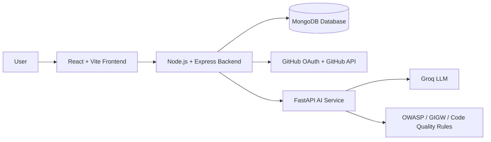
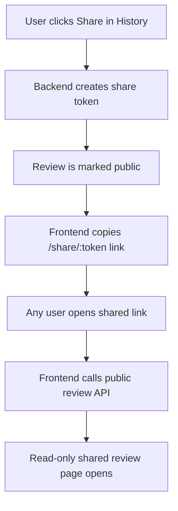

# Meridian.ai — AI-Powered Code Review and Bug Suggestion System

<p align="center">
  
</p>

<p align="center">
  <b>Review smarter. Detect faster. Improve code with AI-guided suggestions.</b>
</p>

<p align="center">
  
  
  
  
  
</p>

---

## Table of Contents

- [Project Overview](#project-overview)
- [Problem Statement](#problem-statement)
- [Proposed Solution](#proposed-solution)
- [Key Features](#key-features)
- [System Architecture](#system-architecture)
- [Tech Stack](#tech-stack)
- [Project Structure](#project-structure)
- [Environment Variables](#environment-variables)
- [Installation and Setup](#installation-and-setup)
- [Application Routes](#application-routes)
- [Backend API Endpoints](#backend-api-endpoints)
- [AI Review and Scoring Logic](#ai-review-and-scoring-logic)
- [Testing Guide](#testing-guide)
- [Team Contributions](#team-contributions)
- [Security and Validation](#security-and-validation)
- [Deployment Notes](#deployment-notes)
- [Future Scope](#future-scope)

---

## Project Overview

**Meridian.ai** is an AI-powered code review platform that helps developers identify bugs, security issues, accessibility concerns, performance problems, and code-quality improvements. Users can paste code, upload code, or load files from GitHub repositories. The system analyzes the code using an AI service and returns severity-based suggestions, an overall quality score, a summary, and possible refactored code snippets.

The platform also includes authentication, GitHub OAuth, review history, profile dashboard, password reset, and public review sharing.

---

## Problem Statement

Manual code reviews can be time-consuming and inconsistent. Reviewers may miss subtle bugs, insecure patterns, accessibility problems, or maintainability issues, especially when reviewing large or unfamiliar codebases.

Developers need a tool that can provide fast, structured, and reliable feedback before the code reaches production or formal review.

---

## Proposed Solution

Meridian.ai provides a web-based platform where users can submit code and receive AI-generated review feedback. The system combines:

- A modern React frontend for code submission and review visualization.
- A Node.js/Express backend for authentication, review storage, GitHub integration, sharing, and secure API handling.
- A FastAPI AI service using Groq LLM integration with deterministic static scoring and rule-based context.
- MongoDB for storing users, reviews, profile data, review history, and shareable review metadata.

---

## Key Features

### Authentication and User Management

- User registration.
- Login using either email or username.
- Two-step login verification code flow.
- Forgot password and reset password functionality.
- GitHub OAuth login.
- JWT-based protected routes.
- Logout flow.
- Profile editing with display name, bio, and avatar options.
- GitHub users retain their GitHub avatar and cannot reset password through Meridian.ai.

### Code Review

- Paste code directly into the editor.
- Upload code files.
- Load code from GitHub repositories.
- Automatic language detection.
- 500-line limit validation on frontend, backend, and AI service.
- AI-generated review summary.
- Severity-based suggestions: High, Medium, Low.
- Category support: Security, Accessibility, Performance, Code Quality, UI/UX, Best Practice, Bug.
- Overall score from 0 to 100.
- Good, Fair, and Poor quality indicators.
- Suggested refactored code snippets.
- Diff-style comparison for suggestions.

### Review History

- Saved review history for authenticated users.
- Review detail view.
- Score-based filters.
- Good/Fair/Poor review classification.
- Delete review functionality.
- Share review functionality.

### Public Shared Review Page

- Users can generate a public share link from review history.
- Shared reviews open at `/share/:token`.
- Public shared reviews are read-only.
- Only reviews marked as public can be accessed.
- Private user data is not exposed in the public response.

### Profile Dashboard

- User profile details.
- Account type display.
- GitHub connection status.
- Review statistics.
- Average score.
- Best score.
- Top reviewed language.
- Good/Fair/Poor review counts.
- High/Medium/Low issue counts.
- Recent review activity.

### AI Service

- Groq LLM integration.
- OWASP-inspired security review rules.
- GIGW/accessibility review rules.
- Code-quality and best-practice rules.
- Strict structured JSON response format.
- AI response cleaning and validation.
- Deterministic static scoring version: `deterministic-static-v5`.
- Stable scoring for repeated review submissions.
- Graceful handling for missing API key, quota limits, invalid AI response, and service errors.

---

## System Architecture



### Review Flow


### Public Sharing Flow



---

## Tech Stack

### Frontend

| Technology | Purpose |
|---|---|
| React | User interface |
| Vite | Fast development and build tool |
| React Router DOM | Page routing |
| Axios | API communication |
| React Syntax Highlighter | Code display and highlighting |
| CSS | Custom styling and responsive UI |

### Backend

| Technology | Purpose |
|---|---|
| Node.js | Runtime environment |
| Express.js | REST API server |
| MongoDB | Database |
| Mongoose | MongoDB object modeling |
| JWT | Authentication |
| bcryptjs | Password hashing |
| Passport GitHub | GitHub OAuth login |
| Nodemailer | Email verification and password reset support |
| Axios | Communication with AI service and GitHub APIs |

### AI Service

| Technology | Purpose |
|---|---|
| Python | AI service language |
| FastAPI | AI-service API framework |
| Uvicorn | ASGI server |
| Groq SDK | LLM integration |
| Pydantic | Request/response validation |
| python-dotenv | Environment configuration |

---

## Project Structure

```txt
Meridian-main/
├── frontend/
│   ├── src/
│   │   ├── components/
│   │   │   ├── CodeEditor.jsx
│   │   │   ├── DiffView.jsx
│   │   │   ├── Navbar.jsx
│   │   │   ├── RepoPicker.jsx
│   │   │   ├── ReviewHistory.jsx
│   │   │   ├── ReviewPanel.jsx
│   │   │   └── SeverityBadge.jsx
│   │   ├── pages/
│   │   │   ├── Home.jsx
│   │   │   ├── Login.jsx
│   │   │   ├── Register.jsx
│   │   │   ├── ForgotPassword.jsx
│   │   │   ├── ResetPassword.jsx
│   │   │   ├── Review.jsx
│   │   │   ├── History.jsx
│   │   │   ├── Profile.jsx
│   │   │   ├── SharedReview.jsx
│   │   │   └── GithubCallback.jsx
│   │   ├── services/
│   │   │   └── api.js
│   │   └── utils/
│   │       └── languageDetect.js
│   ├── package.json
│   └── .env.example
│
├── backend/
│   ├── config/
│   │   ├── db.js
│   │   └── passport.js
│   ├── controllers/
│   │   ├── authController.js
│   │   ├── githubController.js
│   │   └── reviewController.js
│   ├── middleware/
│   │   └── auth.js
│   ├── models/
│   │   ├── User.js
│   │   └── Review.js
│   ├── routes/
│   │   ├── auth.js
│   │   ├── github.js
│   │   └── review.js
│   ├── utils/
│   │   └── emailService.js
│   ├── server.js
│   ├── package.json
│   └── .env.example
│
└── ai-service/
    ├── main.py
    ├── model.py
    ├── requirements.txt
    ├── .env.example
    └── rules/
        ├── owasp_rules.txt
        ├── gigw_accessibility_rules.txt
        ├── code_quality_rules.txt
        └── review_output_rules.txt
```

---

## Environment Variables

Create `.env` files from the provided `.env.example` files.

### Backend `.env`

```env
PORT=5000
NODE_ENV=development

FRONTEND_URL=http://localhost:5173
AI_SERVICE_URL=http://localhost:8000

MONGO_URI=mongodb://127.0.0.1:27017/meridian
JWT_SECRET=replace_with_your_jwt_secret
SESSION_SECRET=replace_with_your_session_secret

GITHUB_CLIENT_ID=your_github_oauth_client_id
GITHUB_CLIENT_SECRET=your_github_oauth_client_secret
GITHUB_CALLBACK_URL=http://localhost:5000/api/github/callback

APP_NAME=Meridian.ai
EMAIL_HOST=
EMAIL_PORT=587
EMAIL_SECURE=false
EMAIL_USER=
EMAIL_PASS=
EMAIL_FROM=
```

### Frontend `.env`

```env
VITE_API_URL=http://localhost:5000/api
```

### AI Service `.env`

```env
GROQ_API_KEY=your_groq_api_key_here
GROQ_MODEL=llama-3.3-70b-versatile
```

> Do not commit real `.env` files. Commit only `.env.example` files.

---

## Installation and Setup

### Prerequisites

- Node.js and npm
- Python 3.10+
- MongoDB running locally or MongoDB Atlas connection string
- Groq API key
- GitHub OAuth app credentials

### 1. Clone the repository

```bash
git clone <your-repository-url>
cd Meridian-main
```

### 2. Start MongoDB

For local MongoDB, make sure MongoDB service is running.

Default local connection:

```txt
mongodb://127.0.0.1:27017/meridian
```

### 3. Setup AI Service

```bash
cd ai-service
python -m venv venv
```

Activate virtual environment:

Windows:

```bash
venv\Scripts\activate
```

macOS/Linux:

```bash
source venv/bin/activate
```

Install dependencies:

```bash
pip install -r requirements.txt
```

Create `.env` from `.env.example`, then start the service:

```bash
python main.py
```

Health check:

```txt
http://localhost:8000/health
```

### 4. Setup Backend

```bash
cd backend
npm install
```

Create `.env` from `.env.example`, then start the backend:

```bash
npm run dev
```

Backend health check:

```txt
http://localhost:5000/api/health
```

### 5. Setup Frontend

```bash
cd frontend
npm install
npm run dev
```

Frontend URL:

```txt
http://localhost:5173
```

---

## Application Routes

| Route | Description | Access |
|---|---|---|
| `/` | Home page | Public |
| `/login` | Login page | Public |
| `/register` | Register page | Public |
| `/forgot-password` | Forgot password page | Public |
| `/reset-password/:token` | Reset password page | Public |
| `/github/callback` | GitHub OAuth callback handler | Public callback |
| `/review` | Code review page | Authenticated |
| `/history` | Review history page | Authenticated |
| `/profile` | Profile dashboard | Authenticated |
| `/share/:token` | Public shared review page | Public read-only |

---

## Backend API Endpoints

### Auth APIs

| Method | Endpoint | Description |
|---|---|---|
| POST | `/api/auth/register` | Register a new user |
| POST | `/api/auth/login` | Login using email/username and password |
| POST | `/api/auth/verify-login-code` | Verify login code and generate JWT |
| POST | `/api/auth/forgot-password` | Send password reset link |
| POST | `/api/auth/reset-password/:token` | Reset password using token |
| GET | `/api/auth/profile` | Fetch logged-in user profile |
| PUT | `/api/auth/profile` | Update profile details |

### Review APIs

| Method | Endpoint | Description |
|---|---|---|
| POST | `/api/review/analyze` | Analyze submitted code |
| GET | `/api/review/history` | Fetch user review history |
| GET | `/api/review/:id` | Fetch one private review |
| DELETE | `/api/review/:id` | Delete a review |
| POST | `/api/review/share/:id` | Generate public share link |
| GET | `/api/review/public/:token` | Fetch public shared review |

### GitHub APIs

| Method | Endpoint | Description |
|---|---|---|
| GET | `/api/github/login` | Start GitHub OAuth login |
| GET | `/api/github/callback` | GitHub OAuth callback |
| GET | `/api/github/repos` | Fetch user repositories |
| GET | `/api/github/repos/:owner/:repo/contents` | Fetch repository contents |
| GET | `/api/github/repos/:owner/:repo/file` | Fetch file content |

### AI Service APIs

| Method | Endpoint | Description |
|---|---|---|
| GET | `/` | AI service status |
| GET | `/health` | AI service health check |
| POST | `/analyze` | Analyze code and return review |
| GET | `/models` | Show available AI model/scoring version |

---

## AI Review and Scoring Logic

The AI service uses a hybrid approach:

1. Rule files provide review context for security, accessibility, code quality, and output format.
2. Groq LLM generates structured review suggestions.
3. AI JSON response is cleaned, parsed, and normalized.
4. Deterministic static scoring calculates a stable final score.
5. Backend stores the normalized review result in MongoDB.

Current scoring version:

```txt
deterministic-static-v5
```

Expected scoring behavior:

| Code Quality | Expected Result |
|---|---|
| Very poor or insecure code | Low score / Poor |
| Medium quality code | Mid score / Fair |
| Clean and structured code | High score / Good |
| Same code reviewed repeatedly | Stable or nearly stable score |

---

## Testing Guide

### Authentication Testing

- Register a new user.
- Login using email.
- Login using username.
- Verify login code.
- Test forgot password.
- Reset password and login again.
- Login using GitHub OAuth.
- Logout and confirm protected pages are blocked.

### Review Testing

- Paste code and run review.
- Upload a code file.
- Load a file from GitHub.
- Submit bad, medium, and good code samples.
- Confirm score ranking is logical.
- Confirm suggestions show severity and category.
- Confirm Diff View opens and wraps code correctly.
- Submit more than 500 lines and confirm validation works.

### History Testing

- Confirm completed reviews are saved.
- Open review details from history.
- Use score filters.
- Delete a review.
- Share a review.
- Open shared review link in logged-out mode.

### Profile Testing

- Open profile dashboard.
- Edit display name and bio.
- Change preset avatar for email/password user.
- Confirm GitHub user keeps GitHub avatar.
- Confirm review statistics update after reviews.

### Error Handling Testing

- Stop AI service and click Analyze.
- Use invalid GitHub token/session.
- Test invalid shared review token.
- Test backend with missing required environment variables.
- Test AI quota/rate-limit response.

---

## Team Contributions

The work was divided module-wise so that every member contributed to a major and visible part of the system.

### Yash — Frontend Review Workflow and Code Analysis UI

**Role:** Frontend Developer

Yash worked on the main code review interface and the user-facing review experience.

**Contributions:**

- Developed and improved the main Review page UI.
- Worked on code input/editor layout and review submission flow.
- Integrated code paste/upload UI with backend review APIs.
- Added frontend 500-line limit display and user guidance.
- Improved review result section with score, summary, severity counts, and suggestions.
- Worked on Diff View layout for original code and suggested fix comparison.
- Fixed code wrapping and long-code layout issues in review and diff panels.
- Improved button styling, cards, spacing, and responsive behavior in the review flow.

**Impact:**

Yash handled the central user-facing feature of the project: the code review screen where users submit code and view AI-generated feedback.

---

### Aditi — Frontend Authentication, History, Profile and UI Polish

**Role:** Frontend Developer

Aditi worked on frontend pages related to user access, profile, dashboard, history, sharing, and overall interface polish.

**Contributions:**

- Developed and improved Login and Register page UI.
- Added Forgot Password and Reset Password frontend pages.
- Updated login UI to support email or username login.
- Worked on Profile Dashboard frontend.
- Added Edit Profile UI with display name, bio, and avatar options.
- Added preset avatar selection for email/password users.
- Maintained GitHub avatar-only display for GitHub users.
- Improved History page UI with Good/Fair/Poor filters and review cards.
- Worked on public Shared Review page UI.
- Improved overall frontend styling, theme consistency, spacing, and visual polish.

**Impact:**

Aditi handled major account, profile, history, and public sharing pages, making the application feel complete, polished, and professional.

---

### Basit — Backend Authentication, GitHub Integration, AI Prompt and Scoring Logic

**Role:** Backend Developer + AI Prompt and Scoring Contributor

Basit worked on backend authentication, GitHub integration, and important AI-service logic related to prompt design and scoring improvement.

**Contributions:**

- Implemented and improved user authentication backend.
- Added login support using either email or username.
- Maintained the verification-code login flow.
- Added Forgot Password and Reset Password backend functionality.
- Added secure reset-token handling and expiry validation.
- Worked on email service support for authentication and password reset messages.
- Implemented GitHub OAuth login flow.
- Added GitHub repository and file-access APIs.
- Improved GitHub token validation and GitHub API error handling.
- Built and refined the AI review prompt used for generating structured code-review feedback.
- Improved the scoring logic so bad, medium, and good-quality code receive more logical scores.
- Helped reduce repeated-review score variation for the same submitted code.
- Supported backend-to-AI-service integration so review results could be stored and displayed correctly.
- Added handling for AI-service timeout, unavailable service, invalid response, and quota/rate-limit cases at the backend integration layer.

**Impact:**

Basit handled critical backend access features and contributed to the AI prompt and scoring layer, ensuring users can log in securely, connect GitHub, submit code, and receive more reliable AI review scores through a stable backend workflow.

---

### Kantesh — Backend Review System, Database and API Hardening

**Role:** Backend Developer

Kantesh worked on the backend review system, MongoDB models, review history, public sharing, validation, and API safety.

**Contributions:**

- Developed and improved review controller APIs.
- Added backend 500-line validation for code submissions.
- Added empty code and invalid input validation.
- Updated Review model for structured suggestions.
- Added severity and category support in saved reviews.
- Implemented review history storage and retrieval.
- Added ownership protection for review view, delete, and share actions.
- Added delete review functionality.
- Added share review functionality using public tokens.
- Added public shared review backend API.
- Improved MongoDB connection handling.
- Improved backend route-level validation and clean error responses.

**Impact:**

Kantesh handled the core backend review and database system, ensuring reviews are validated, stored, protected, retrieved, deleted, and shared safely.

---

### Kriti — AI-Service Rules, Review Standards, AI Response Handling and QA

**Role:** AI-Service Developer + Integration and QA Lead

Kriti worked on the AI-service rule base, review standards, response validation, service reliability, and final testing of the complete project.

**Contributions:**

- Created and maintained the AI-service rule text files used as review context.
- Added GIGW/accessibility rules for government-style accessibility and usability checks.
- Added OWASP-inspired security rules for identifying insecure coding patterns.
- Added code-quality and best-practice rules for maintainability and cleaner code suggestions.
- Added review-output rules to keep AI responses structured and consistent.
- Worked on Groq-based AI review service integration and AI-service request/response handling.
- Added AI response cleaning, JSON parsing, and validation logic.
- Verified that AI suggestions include severity, category, issue, suggestion, and refactored code.
- Improved AI-service error handling for missing API key, timeout, quota/rate-limit, and invalid AI response cases.
- Helped ensure the AI service follows rule-based review standards instead of giving random or unsupported suggestions.
- Performed end-to-end testing of the AI review flow.
- Coordinated integration testing across frontend, backend, and AI service.
- Tested authentication, review, history, profile, sharing, GitHub, and AI error-handling flows.

**Impact:**

Kriti handled the AI-service rule foundation, output reliability, and final integration testing, ensuring that Meridian.ai produces structured, rule-guided, and meaningful code review feedback.

---

### Contribution Summary Table

| Team Member | Main Area | Key Contribution |
|---|---|---|
| Yash | Frontend Review UI | Review page, code editor flow, result display, Diff View, review page responsiveness |
| Aditi | Frontend Auth/Profile/History | Login/Register UI, forgot/reset pages, profile dashboard, history page, shared review UI |
| Basit | Backend Auth + GitHub + AI Prompt/Scoring | Email/username login, password reset APIs, GitHub OAuth, GitHub APIs, AI prompt, scoring logic |
| Kantesh | Backend Review + Database | Review APIs, MongoDB review model, validation, history, delete/share, public share API |
| Kriti | AI-Service Rules + Validation + QA | GIGW/OWASP/code-quality rule files, review-output rules, AI response validation, AI-service reliability, integration testing |

---

## Security and Validation

- Passwords are hashed before storage.
- JWT is used for protected API access.
- Private review APIs require authentication.
- Review ownership is checked before view, delete, and share operations.
- Public shared review access requires a valid share token.
- Shared review response does not expose private user details.
- Code input is limited to 500 lines.
- Backend rejects invalid JSON and oversized requests.
- AI-service failures are handled gracefully.
- Real `.env` files should never be committed.

Recommended `.gitignore` entries:

```gitignore
node_modules/
.env
__pycache__/
*.pyc
venv/
dist/
```

---

## Deployment Notes

For deployment, update environment variables with production URLs.

### Frontend

- Deploy frontend on platforms such as Vercel, Netlify, or Render Static Site.
- Set `VITE_API_URL` to the deployed backend API URL.

Example:

```env
VITE_API_URL=https://your-backend-url.com/api
```

### Backend

- Deploy backend on platforms such as Render, Railway, or similar Node.js hosting.
- Set `FRONTEND_URL` to the deployed frontend URL.
- Set `AI_SERVICE_URL` to the deployed AI-service URL.
- Use MongoDB Atlas for cloud database.
- Configure GitHub OAuth callback URL with deployed backend URL.

Example:

```env
FRONTEND_URL=https://your-frontend-url.com
AI_SERVICE_URL=https://your-ai-service-url.com
GITHUB_CALLBACK_URL=https://your-backend-url.com/api/github/callback
```

### AI Service

- Deploy AI service on a Python-supported hosting platform.
- Set `GROQ_API_KEY` and `GROQ_MODEL` in the hosting dashboard.
- Confirm `/health` works after deployment.

---

## Future Scope

- Team-based workspaces.
- Pull request review integration.
- PDF/exportable review reports.
- More language-specific static analysis rules.
- Admin dashboard.
- Comment threads on review suggestions.
- Role-based access control.
- CI/CD integration.
- Support for private organization repositories.

---

## Final Note

Meridian.ai is designed to support faster, more structured, and more reliable code review. It combines AI-powered review suggestions with deterministic scoring, secure authentication, review history, GitHub integration, and public review sharing to create a practical developer productivity tool.

